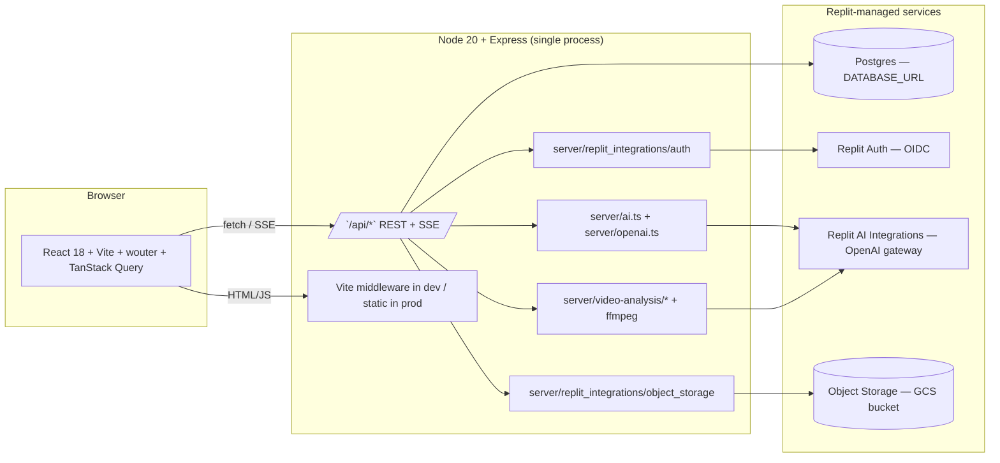
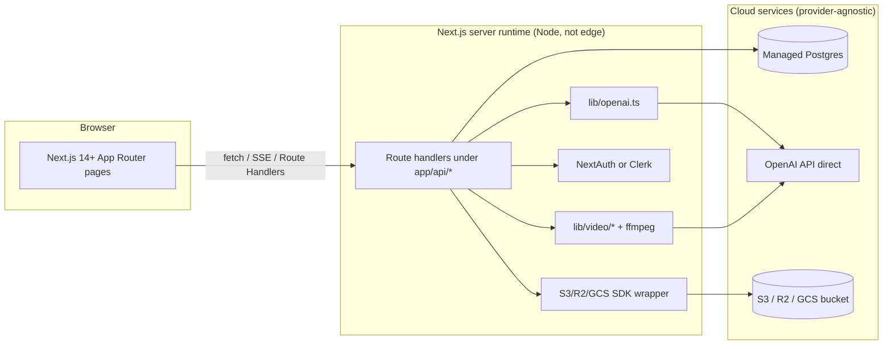

# 02 — Architecture

## Current architecture (Replit)



Key facts:

- **Single Node process** serves both the API and the frontend on `process.env.PORT` (default 5000). In dev, Vite middleware handles the SPA with HMR; in prod, `server/static.ts` serves built assets. See `server/index.ts`.
- The build script `script/build.ts` (invoked by `npm run build`) bundles the server to `dist/index.cjs` with esbuild and the client to `dist/public/` with Vite.
- All state lives in **Postgres** (cases, users, sessions, chat) plus **object storage** for compressed video blobs. There is no Redis, no S3 directly, no separate worker.
- The AI client is a thin `fetch` wrapper (`server/openai.ts`) pointing at Replit's OpenAI-compatible gateway base URL. There is no `openai` SDK dependency.
- Video analysis runs synchronously inside the request via `ffmpeg`/`ffprobe` subprocesses (`server/video.ts` and `server/video-analysis/frames.ts`).

## Target architecture (Antigravity)



Recommended target stack:

| Layer | Recommendation | Why |
| ----- | -------------- | --- |
| Framework | **Next.js 14+ App Router** | Replaces both Express + Vite. SSR for case pages improves SEO and initial paint. |
| Runtime | **Node.js runtime** (`export const runtime = "nodejs"`) | The video/ffmpeg path and OpenAI streaming both need Node primitives. Do not target edge. |
| Database | **PostgreSQL** (any managed: Neon, Supabase, RDS) | Already Postgres-shaped. Keep Drizzle ORM and the schema file unchanged. |
| Auth | **NextAuth (Auth.js) v5** with Google provider + Credentials provider for the username-only fallback | Replaces Replit Auth. See doc 5 for parity matrix. |
| LLM | **OpenAI API directly** via the official `openai` SDK or fetch | Replaces the Replit AI Integrations gateway. Keep the `MODELS` tier table. |
| Object storage | **S3-compatible** (S3, R2, B2) or **GCS** | Replaces Replit Object Storage. Only used for video blobs. |
| File uploads | Next.js Route Handler accepting `multipart/form-data` (the `formidable` or built-in `request.formData()` API) | Replaces Express + `multer`. |
| Frontend deps | Keep React 18, wouter→**Next router**, TanStack Query, shadcn/ui, Tailwind, Radix, lucide-react | Lift-and-shift; only the router and Vite plugins change. |

## Replit-specific → Antigravity replacement table

| Replit thing | Where it appears | Antigravity replacement | Notes |
| ------------ | ---------------- | ----------------------- | ----- |
| **Replit Auth (OIDC SSO)** | `server/replit_integrations/auth/replitAuth.ts`, mounted via `setupAuth(app)` in `routes.ts` | **NextAuth (Auth.js)** with the Google provider | Replit Auth is essentially Google OIDC behind a Replit-issued client. Swap to Google directly. Preserve "first SSO user becomes admin" in the NextAuth `signIn` callback. |
| **Replit session cookie + `connect-pg-simple` in the Replit auth wrapper** | `getSession()` in `server/replit_integrations/auth/replitAuth.ts` | NextAuth's built-in session (JWT or DB) | Keep the 10-year TTL (`maxAge` on the session config). Mirror the existing `sessions` table only if you keep DB sessions; with JWT sessions you can drop it. |
| **Replit AI Integrations gateway** (`AI_INTEGRATIONS_OPENAI_API_KEY` + `AI_INTEGRATIONS_OPENAI_BASE_URL`) | `server/openai.ts` | OpenAI API directly | Replace the two env vars with `OPENAI_API_KEY` (and optionally `OPENAI_BASE_URL` if you proxy). Same `MODELS` tier object. |
| **Replit Object Storage wrapper (`@google-cloud/storage`)** | `server/replit_integrations/object_storage/*`, used by `uploadVideoToStorage()` and the `/api/videos/:caseId/stream` proxy | S3/R2 via `@aws-sdk/client-s3`, or GCS via `@google-cloud/storage` directly | The Replit wrapper just calls GCS under the hood. Switch to the SDK of your chosen bucket. Range-request streaming still applies — Next's `Response` with `body: stream` supports it. |
| **Replit "workflows"** (the `Start application` workflow that runs `npm run dev`) | `.replit` config + Replit UI | A plain `package.json` script: `next dev` for dev, `next start` for prod | Workflows are just a UI for `npm run …`. No code change needed. |
| **Vite middleware** for HMR mounted on Express (`server/vite.ts`, dev only) | `server/index.ts` branch on `NODE_ENV` | Next.js dev server (`next dev`) | Drop `server/vite.ts` and `server/static.ts` entirely. |
| **`@replit/vite-plugin-*`** (`cartographer`, `dev-banner`, `runtime-error-modal`) | `vite.config.ts` (and devDependencies in `package.json`) | None — delete these | They only do anything inside Replit's workspace. Next.js has its own dev overlay. |
| **`AI_INTEGRATIONS_*` env names** | `server/openai.ts` | `OPENAI_API_KEY`, `OPENAI_BASE_URL` | Rename the two env vars and update the single read site in `openai.ts`. |
| **Replit Database provisioning ("DATABASE_URL ensure the database is provisioned")** | `server/db.ts`, `drizzle.config.ts` | Any managed Postgres URL | No code change. Just point `DATABASE_URL` at your new instance. |
| **Replit-only `repl.deploy` / autoscale** | Replit UI | Vercel / Fly / Render / a single VM | Whatever you deploy to, ensure ffmpeg + ffprobe are on PATH (see doc 8). |

## Directory map (current → target)

```
current/                              target/
├── client/src/...                    ├── app/                   ← Next App Router pages
│   ├── pages/                        │   ├── (public)/...        ← case, archive
│   ├── components/                   │   ├── (auth)/login
│   ├── hooks/                        │   ├── add/page.tsx
│   └── lib/                          │   ├── edit/[id]/page.tsx
├── server/                           │   └── users/page.tsx
│   ├── routes.ts                     ├── app/api/                ← Route Handlers
│   ├── ai.ts                         │   ├── cases/route.ts, [id]/route.ts
│   ├── openai.ts                     │   ├── ai/analyze/route.ts
│   ├── video.ts                      │   ├── ai/analyze-video-stream/route.ts
│   ├── video-analysis/               │   ├── auth/[...nextauth]/route.ts
│   ├── storage.ts                    │   └── videos/[caseId]/stream/route.ts
│   ├── db.ts                         ├── lib/
│   ├── static.ts (delete)            │   ├── openai.ts          ← unchanged shape
│   ├── vite.ts   (delete)            │   ├── video/             ← unchanged shape
│   └── replit_integrations/ (delete) │   ├── db.ts
├── shared/                           │   ├── storage.ts
│   ├── schema.ts                     │   └── auth.ts            ← NextAuth options
│   └── models/auth.ts                ├── shared/                 ← keep as-is
└── package.json                      │   ├── schema.ts
                                      │   └── models/auth.ts
                                      └── package.json
```

## What does NOT change

- **`shared/schema.ts` and `shared/models/auth.ts`** — drizzle tables, types, and Zod insert schemas should port verbatim. (See doc 3.)
- **`server/ai.ts` prompts** — system prompts are product, not infrastructure. Lift them as-is.
- **`server/video-analysis/frames.ts` smart-frame logic** — ffmpeg calls, scene detection, cropdetect, timestamp planning all stay.
- **Most UI components** (`client/src/components/*`) — they only import from `@/components/ui/*` and TanStack Query, both of which are framework-agnostic.

## What you should drop entirely

- `server/vite.ts`, `server/static.ts`, `script/build.ts` — Next handles all of it.
- `@replit/vite-plugin-*` devDependencies.
- `vite.config.ts`, `tailwind.config.ts` shape stays but `vite.config.ts` becomes `next.config.ts`.
- The `extractFramesFromVideo` legacy function in `server/video.ts`/`server/video-analysis/frames.ts` — it's dead code now that smart frames are the default. Only `extractSmartFrames`, `extractSingleFrame`, `compressVideo`, and `getVideoInfo` are still used. (You can also drop `server/video.ts`'s `extractFramesFromVideo`.)
- The `/api/ai/test-multi-image` route (`server/routes.ts:743`) — it's a dev scratch endpoint.
