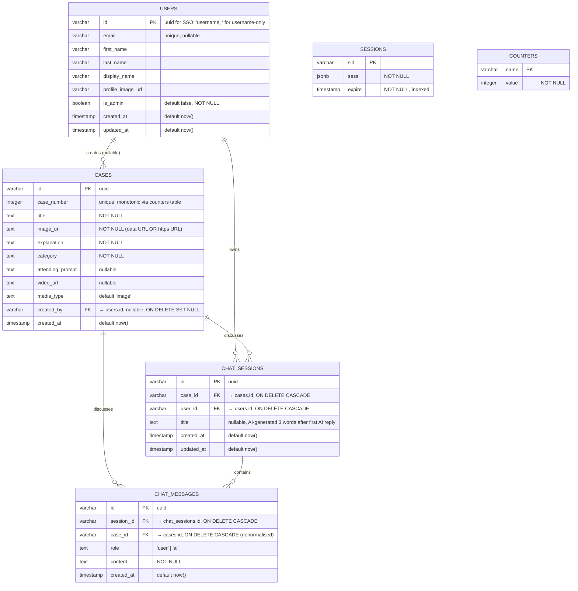

# 03 — Data Model

## ER diagram



## Table inventory

| Table | Purpose | Owned by file |
| ----- | ------- | ------------- |
| `users` | All accounts (SSO + username-only) | `shared/models/auth.ts` |
| `sessions` | Express-session storage (required by current Replit Auth wrapper) | `shared/models/auth.ts` |
| `cases` | Teaching cases | `shared/schema.ts` |
| `chat_sessions` | One AI conversation per (user, case) | `shared/schema.ts` |
| `chat_messages` | Individual turns in a chat session | `shared/schema.ts` |
| `counters` | Monotonic counter for `cases.case_number` | `shared/schema.ts` |

> **Antigravity note:** the `sessions` table is only mandatory if you keep a server-session model. If you swap to NextAuth with JWT sessions, you can drop it. If you swap to NextAuth with a database adapter, replace it with that adapter's standard tables (e.g. `Session`, `Account`, `VerificationToken`).

## Insert schema rules (Zod, via `drizzle-zod`)

The current repo derives insert schemas with `createInsertSchema(table).omit({...})`. Mirror these exactly:

```ts
// shared/schema.ts (current behavior)
export const insertCaseSchema = createInsertSchema(cases).omit({
  id: true, caseNumber: true, createdAt: true, createdBy: true,
});
export const insertChatSessionSchema = createInsertSchema(chatSessions).omit({
  id: true, createdAt: true, updatedAt: true,
});
export const insertChatMessageSchema = createInsertSchema(chatMessages).omit({
  id: true, createdAt: true,
});
```

Specifically:

- **`cases.caseNumber`** is **server-assigned** by `getNextCaseNumber()` in `server/storage.ts` using a `counters`-table upsert that takes `GREATEST(MAX(case_number), counters.value) + 1`. Clients must not send `caseNumber`.
- **`cases.createdBy`** is set from the authenticated session, never from the request body.
- **`cases.mediaType`** defaults to `'image'`. Allowed: `'image'` | `'video'`.
- **`cases.videoUrl`** must be `null` for images, and a URL pointing to object storage for videos (consumed by the `/api/videos/:caseId/stream` proxy).
- **`chat_messages.role`** is a free-text field today, but only `'user'` and `'ai'` are ever written. Lock it down with a Zod enum on the new stack.
- **`chat_sessions.title`** is `null` until the first AI reply, after which `generateChatTitle()` writes a 3-word title.

## Counter mechanics

`counters` is a tiny table (`(name primary key, value int not null)`) used to issue case numbers without races. The query in `getNextCaseNumber()`:

```sql
INSERT INTO counters (name, value)
VALUES ('case_number', GREATEST(COALESCE((SELECT MAX(case_number) FROM cases), 0), 0) + 1)
ON CONFLICT (name) DO UPDATE
  SET value = GREATEST(counters.value, COALESCE((SELECT MAX(case_number) FROM cases), 0)) + 1
RETURNING value;
```

Port this verbatim. It also self-heals if a case is deleted and re-seeded.

## Cascade behaviour

| Action | Effect |
| ------ | ------ |
| Delete a `case` | All `chat_messages` for it are deleted first (explicit in `storage.deleteCase`), then the case row. Any `chat_sessions` for it cascade via FK. |
| Delete a `user` (admin action) | Their authored `cases.created_by` is **set to NULL** (cases are preserved for other learners). Their `chat_sessions` and `chat_messages` cascade-delete. See `authStorage.deleteUser`. |

## Username-only user IDs

Username-only accounts use IDs of the form `username_<lowercased-slug>` (e.g. `username_aisha`). This is checked by `isUsernameUserId(id)` in `server/replit_integrations/auth/storage.ts` and is enforced server-side so these IDs can never be granted admin. Preserve this convention on the new stack (or pick a different sentinel and update the check in one place).
